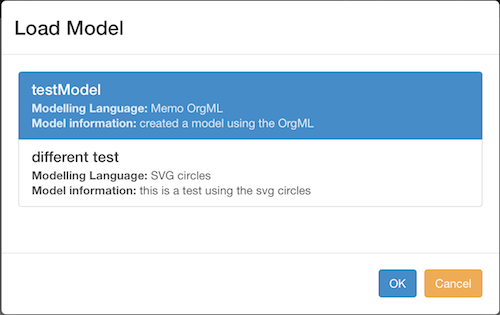

# SVG Modelling Tool
This is a short documentation about the prototype of the tool. The user interface and the file structure of the tool are explained.

## User Interface
---
When the tool is opened, a modal window opens and asks the user, which modelling language he wants to use.

### Choosing the modelling language - modal


In this modal, a modelling language may be selected. Use the OK-button to load it.

### The environment


The panel on the left side shows all available symbols of the selected modelling language. Every defined type will
be printed as a heading, all symbols, which are assigned to that type are printed under this heading. The attribute
inspector shows below the symbols. On the current screen, it shows a static text, because no element is selected.

The user has several options to change the current modelling language. The first option is to open the dropdown after
"Modelling languages", which is in the middle of the top navigation bar. Opening the drodpown shows all available
modelling languages. If a modelling language is clicked, the tool will load the specification of the selected modelling
language. Another option is to load a saved model. If the modelling language of a model, which is about to load, differs
from the current selected modelling language, the tool will change the modelling language accordingly.

The icons on the right side of the top navigation bar have different function. The first four icons (the arrows) let the
user pan the working area in the according direction. This is to overview also large models. The magnifying glasses
zoom in and out on a model. The next icon resets the zoom and panning. The symbol presenting the fire lets the user
wipe out the local persistent data completely. **Note** Wiping the local data is just a feature for development and
testing. The floppy symbol lets the user save the current model. The folder symbol shows all models, which are
persistent in the user-database. The following two symbols are used to export and import models to the local database.
The symbol representing the trash-bin is used to wipe the current working area. The symbol showing the check mark is
used to validate the model, which is currently in the working area. The symbol containing the question mark opens the
page you are currently viewing.

### Attribute inspector


The attribute inspector shows all attributes of the current selected symbol. The user may change the values, the changes
are saved immediately. The button "Delete Element" may be use to delete the current selected element from the
working space.

### Save a model


In order to save a model, the user has to enter a name and some information as description about the model. The dropdown
next to the model name input fields lists all names of models, which are already saved. This makes it easier to just
"copy" an existing model name. If a model name is entered, which already exists, the model will be overwritten.

### Load a model



The load modal shows all models, which are saved. It shows the names, the used modelling language and the information.
In order to load a model, select one from the list and click "OK".

### Working space

Elements may be dragged and dropped from the panel on the left side to the working space. Inside the working space,
elements can be moved by using drag and drop. An element can be selected by clicking it. Using mouse over an element
shows the point, with which an edge may connect.

## Adding a new modelling language
---
The tool implements an easy modelling language for demonstrations purposes. It is called "testElements". In order to
add a new modelling language, a JSON file needs to be added to the folder "modLangs/languages/". This JSON file must
contain the types of symbols, the graphical representation of a symbol, the edges and optionally constraints. A type
needs to be represented using the following structure: The name of the type is used as a key for the whole object,
it is repeated after the key "name" inside the object. The "rules" define the syntax rule, e.g. which type may connect
to and from the current type. "min" and "max" define the minimum and maximum occurrences of the types before and after. 
"alert" defines a message to the user, in case he violates the rule. Attributes define the attributes of the type.
Currently, the prototype implements the following types:

* String
* Bool
* Integer
* Time (a certain point in time)
* Duration (using hours:minutes)

These "auxiliary types" could be easily extended using the service "attributeListService" (see implementation details).
"constraints" names all constraints for the type in an array.

        "blueSymbol": {
            "name": "blueSymbol",
            "rules": {
                "out": {
                    "greySymbol": {
                        "min": 0,
                        "max": 1,
                        "alert": "A blueSymbol resolves in 0..1 greySymbol instances."
                    }
                },
                "in": {
                    "orangeSymbol": {
                        "min": 0,
                        "max": 1,
                        "alert": "An orangeSymbol resolves in 0..1 blueSymbol instances."
                    }
                }
            },
            "attributes": [
                {
                    "key": "name",
                    "type": "String",
                    "value": "The name of the blueSymbol"
                }
            ],
            "constraints": ["constraint1"]
        }

The following JSON structure shows the representation of a graphical symbol. The id should be an unique id. The cleanName 
is a String, which will be printed in the user interface for using the symbol. "svgPath" defines the SVG file of the
symbol. "svgIcon" defines the PNG file of the symbol. "svgPath" and "svgIcon" really is the same file, just different
formats. PNG is the faster way to just give a preview in the user interface, while the modelling itself works with
vector based graphics, therefore SVG. The type references the type of the symbol.

    {
        "id": "orangeCircle",
        "cleanName": "orange circle",
        "svgPath": "testElements/orangeCircle.svg",
        "svgIcon": "testElements/orangeCircle.png",
        "type": "orangeSymbol"
    }

The following JSON structure shows the representation of the edge. The tool supports at this points just one type
of edges, so this can be copied.

    "edges": [
        {
            "id": "sequence",
            "cleanName": "sequence",
            "edgeStyle": "stroke:#000000;stroke-width:4px;marker-end: url(#markerTriangle);",
            "type": "sequence",
            "attributes": [
                {
                    "key": "name",
                    "type": "String",
                    "value": "The name of the sequence"
                }
            ]
        }
    ],

The following JSON structure shows, how a constraint is added. It defines the name, additionally you may use either
"adHoc" as boolean or "global" as boolean. "adHoc" constraints are validated, when an edge connects to a symbol.
"global" defines constraints, which have to be executed, also when there is no symbol on the working space, for which
the constraint was defined. Example: A process might have the constraint, that a type "startElement" is required
for the model. This constraint has to be validated also, if there is no instance of "startElement". The path defines 
the javascript files, which defines the constraint. In order to define constraints, javascript has to be used at the 
current stage of the prototype. The alert defines a message to the user, in case the constraint can't be validated.


    {
        "name": "constraint1",
        "adHoc": false,
        "path": "modLangs/languages/testElements/constraints/constraint1.js",
        "alert": "Violation constraint1: If a blueSymbol has an incoming edge from orangeSymbol, it must have an outgoing edge to a greySymbol"
    }


The following javascript excerpt shows an example of a constraint. This constraint checks, if at least two symbols
of the type "orangeSymbol" exist on the working space. All constraints use the parameters "symbol, edges, symbols".
The symbol defines the current symbol, on which the constraint is used. edges define all edges of the model and symbols 
contain all symbols of the model. **Note** Global constraints should not use "symbol", because the parameter will be
undefined for global constraints. The constraint in the example iterates over all existent symbols and check, if their
type is "orangeSymbol". If yes, the counter is raised by 1. The return statement returns false, if the counter is smaller
than 1 or true, if it is bigger than 1. The constraints always return either true or false.

    var constraint2 = function (symbol, edges, symbols) {
        var counter = 0;
    
        console.warn("start");
    
        for (var key in symbols) {
            if (symbols[key].type === "orangeSymbol") {
                counter++;
            }
        }
    
        console.log("counter is " + counter);
    
        return (counter > 1);
    };
    appConstraints["constraint2"] = constraint2;


**Reommendation** Having a look on the demonstration modelling language "testElements" will foster the understanding,
how a modelling language needs to be added using this tool.

## Implementation details
---
The application is structured like this:

* app (Holds the application)
    * controllers (Holds the angularJS controllers of the application)
    * directives (Holds the angularJS directives of the application)
    * services (Holds the angularJS services of the application)
    * utility (All other javascript files, which don't fit any of the three above)
    * app.js (The main application variable is defined here)
* bower_components (Contains the libraries used by this project)
    * angular (The angularJS framework)
    * angular_bootstrap (Bootstrap implementation for angularJS)
    * bootstrap-css-only (The Bootstrap css files)
    * lawnchair (Client side persistence library)
* documentation (Contains files for the documentation you are viewing in this moment)
* modLangs (Contains the files for specifying a modelling language)
    * connectors (static folder with a static file, the tool supports only one edge at this moment)
    * languages (files, which are defining the modelling languages)
    * langs.json (JSON file, which tells the tool, what modelling languages should be loaded)
* view (contains view elements for the tool)
    * modals (This folder contains the modal windows, which are used in this application)
    * partials (Contains partials, at the moment only the icon bar of the top navigation)
    * properties (Contains the partial, which defines the attribute inspector)
* bower.json (bower file for specifying the dependencies used in this project)
* documentation.md (the file you are viewing now)
* index.html (the main view file, which should be opened by the browser to use the tool)

### Controllers

###### modellingController.js

The main controller of the application. The initialization and re-initialization logic is defined here. It defines
the central actions and broadcasts. There is basically no other "real" controller, the other available controllers
are just used for the modal window. Using the bootstrap implementation for angularjs, every modal window needs an
own controller. All the modal-window controllers are triggered from the modellingController and the action is
delegated back to the modellingController, when the modal window is closed. There are the following modal window
controllers at the moment:

* exportModalController.js
* importModalController.js
* loadModalController.js
* saveModalController.js
* selectLanguageController.js

### Services

###### alertsMessagesService.js

This service is used, to give direct access to the alerts everywhere in the application. By using this service, an
alert can be sent to the user interface.

###### attributeListService.js

This service is used to define auxiliary types for the application. It has a method, which defines all auxiliary types
and another method, which is called, when a JSON file is imported. In this case, the types have to be imported properly
from the stringified values.

###### currentModelService.js

This service is used to hold the model, which is currently opened. Using a service, the current model may be easily
accessed on different places of the application.

###### elementsService.js

This service stores all the elements, which are on the working area of the modelling tool. It also offers methods to
alter the model represented on the working area, like removing, adding and changing elements. Furthermore, there are
methods to connect and disconnect symbols. The validation against the syntactical rules and the constraints is also
placed here.

###### importModelService.js

This service is a helper to persist an imported model after uploading it, until it is imported to the database.

###### languageStoreService.js

This service handles database transactions for the languages. It could be useful in future to load the whole language
specification into the local database, so the tool need to parse the JSON file only one time.

###### modellingRulesService.js

This service is used to get the syntactical rules for a certain type and to get the constraints for a type or all
global constraints.

###### modelStoreService.js

This service handles the database transactions for the models. It offers methods to save and load methods.

###### uniqueIdService.js

Every element on the working area should have an unique id, so it can be identified. This service generated the unique
ids. At this stage, it just counts from 0 up. When a model is loaded or imported, the first value will be overwritten 
using the last id of imported/loaded model.

###### connectorContainerDirective.js

This directive holds all edges of the working area. It reacts to the broadcasts to add and remove a connector, and to
reset the container. The container holding the edges is separated from the symbol container due to the HTML hierarchy.
Like this, the edges are always "in front" of the symbols.

###### connectorHighlightDirective.js

This directive is used to highlight an edge, after the user clicked it.

###### constraintHelperDirective.js

This directive is used to load an additional helper script, after all constraints of a modelling language are loaded.

###### dockerDirective.js

This directive is used to show the "dockers" of the selected element. The term "dockers" is used in another
modelling application called "Oryx", it shows the points on a symbol, to which an edge may connect.

###### downloadLinkDirective.js

This is a helper directive to download files from the application. Unfortunately, it doesn't seem easily possible to just
"send a file to the browser". Instead, there is a hidden ```<a>``` tag, the src-attribute will be set with the link to the file
which needs to be downloaded, then this link is clicked by the application.

###### fileUploadDirective.js

This directive is used to upload a file, when the "import model" function is used.

###### lineEndPointDirective.js

This directive is used to move an edge while dragging and dropping the end of the edge. On the start end end there
is a transparent SVG circle, which the user may drag and drop. The edge is re-drawn using the new coordinates.

###### lineGroupDirective.js

This directive is used to show the "crosshair" symbol on the start and on the end of the edge, so the user understands,
that he is able to drag and drop the edge on those places.

###### linePointDirective.js

Not used at the moment.

###### lineStartPointDirective.js

Same as lineEndPointDirective, but for the starting point of an edge.

###### myDraggableDirective.js

This directive is used on every symbol on the palette. It enables dragging of the element.

###### myDropableDirective.js

This directive is used on the working area of the tool. It enables dropping symbols dragged from hte palette into the
working area.

###### mySvgElementDirective.js

Every symbol and edge on the working area is using this directive. It enables moving the symbols and connecting edges 
to symbol. When connecting, it triggers the validation of the elementsService. **Note** Right now, this directive
is messy, because it shares logic for edges and symbol. This should be separated later.

###### showDockersDirective.js

This directive is used to show the dockers on a symbol.

###### svgAreaDirective.js

This directive is used for the svg area, which stores all svg elements. When a model is loaded, it sets the svg area
to the SVG elements of the loaded model. Furthermore, it contains the marker definition of the edges.

###### svgConnectorLineDirective.js

This directive is used to redraw an edge. It can be used to update the coordinates of the start point or the end point
of the edge.s

###### svgControlsDirective.js

This directive is used to apply zoom to the working area. Also other controls could be added here.

###### symbolContainerDirective.js

This directive contains all symbols, which are currently on the working area. It offers methods to add and remove a
symbol and to reset the container.

###### symbolHighlightDirective.js

This directive is used to highlight a symbol, after the user clicked it.

###### symbolPropertiesDirective.js

The directive used for the attribute inspector of the application.

###### validateAttributeDirective.js

This directive is used to trigger the validation against the constraint on a symbol after its attributes were altered.

###### constraintHelper.js (utility)

The constraints are defined by the user in javascript files outside of the angularJS scope. These constraints need to
be passed to the controller. Additionally, the user might change the modelling language, so the constraints also change.
Short explanation on the workflow:

When defining constraints, every constraint needs to be added to the array ```javascript appConstraints```. This array
is initialized in index.html. Furthermore, there is a ```html <script>``` tag which iterates over all paths to 
the javascript files, which contain the constraints, so after this iteration all constraints are available in the array
```javascript appConstraints```. On the last iteration, the modellingController adds another ```html <script>``` tag to
the HTML-body, which contains the path to this script (constraintHelper.js). This script will then load the array
```javascript appConstraints``` back to the modellingController. This procedure is repeated, when the modelling language
is changed, or the tool is reloaded.